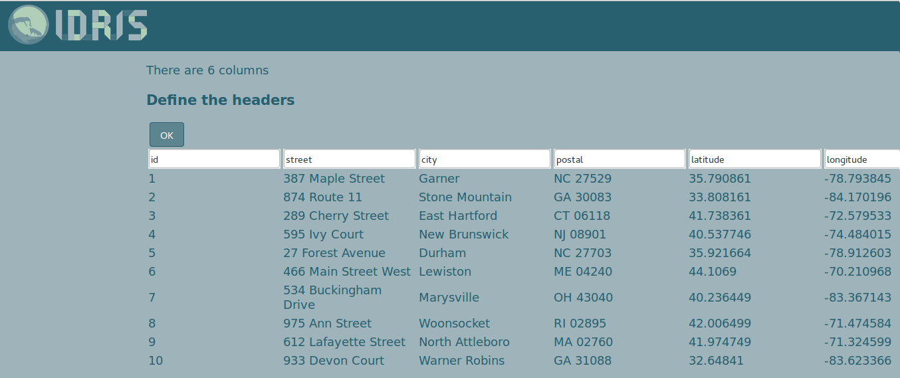

# Use case 1

An example usage of [Idris online tools](http://www.idris-maps.com)

## Scenario

You have a company with branches in different cities and want to show where they are on a map on your website.

### 1. Convert adresses to coordinates

Idris-map only has one office so far. For this example, we will use 50 randomly generarted postal adresses that we got [here](https://www.randomlists.com/random-addresses). You can download the file above, ```random-adresses.tsv``` and open it in your favorite spreadsheet. We use [gnumeric](http://www.gnumeric.org) but LibreOffice or Excel work fine as well.

To get the coordinates, we will use one of the numerous [online batch geocoders](https://www.google.ch/search?q=batch+geocoding). We picked [this one](http://www.findlatitudeandlongitude.com/batch-geocode). 

* If your adresses do not have a unique ID, create one by adding a column in the spreadsheet
* Copy the ID and adress columns in the **input** section an press **geocode**
* Wait until the geocoding is done
* Copy the **output** section and paste it in your spreadsheet 
* Make sure the ID of the pasted columns match the ID of the existing
* Remove duplicate columns

### 2. Convert to GeoJSON

Now in order to use the coordinates on the web we need to convert our spreadsheet to GeoJSON.

* Go to the [Idris converter](http://www.idris-maps.com/tools/convert)
* Click **Paste data from a spreadsheet**
* Copy your data and click **Done**
* You will be asked if the first column is the header. If you used our random adresses, click **No**
* Fill in the name of each column as in the screenshot below



* Choose which column corresponds to **latitude** and **longitude**. We called them just that in the previous screen. Click **OK**
* Download your GeoJSON by clicking the **Download** button
* Rename your file if needed, ```branches.json``` for example

### 3. Create the map

It is time to create our map. 

* Go to [Zoomable map](http://www.idris-maps.com/tools/zoomable-map)
* Drop ``branches.json``` in the designated area
* You will now see a marker representing each branch on a white background
* Click the tiles button to choose the background map


* I choose **NASA night**. Try them out to find the one that suits you.

When a user clicks on the map we want to display the name of the branch.

* Click the style button 


* Choose to **style** the **branches** layer
* Click the **Labels** button
* Choose which property (a column from the spreasheet) should be displayed

In this case we only have the adress so I will choose **city** but you could have any column on your spreadsheet, including HTML with links to the website of each branch

* After choosing the property and clicking **OK**, try clicking a marker on the map. It shows the name of the city (or whatever you choose to display)

### 4. Add the map to your website

Time to add the map to your website.

* Click the **script** button


* Download the script
* Open the HTML page  to which you want to add the map
* Add the links to LeafletJS script and CSS as well as a link to the downloaded script in the head of your HTML. You can copy the links from the **script** screen
* In your HTML add a ```<div>``` where you want to have the map. It needs to have an ID and a defined height. If no height is specified, it will be zero.
* At the end of the body of the HTML declare to which element you want to add the map (the ```<div>``` you just created) by adding a script element like this

```
<script>
addToMap('mapDiv')
</script>
```

In this case we suppose that the ID of the div is **mapDiv**. It could be anything as long as it is unique.

* Make sure the downloaded script is in the same folder as the HTML page. If not, change the link to it in the head.

### That's it, you have a map on your website

You can see the result [here]()


